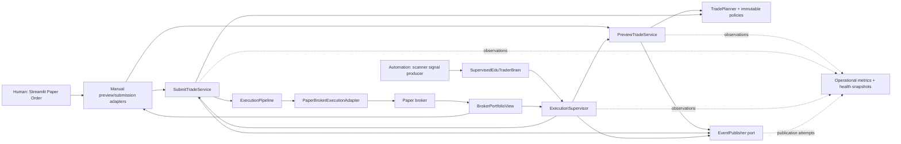

# EduTraderAI v4.0 Architecture

This document is the canonical architecture inventory for `v4.0.0-rc1`. It
describes the six supported execution paths, their rollback boundaries, and the
ADRs that govern the unified deterministic platform.

## Canonical architecture



The dependency rule is always inward:

```text
Streamlit / signal producers / concrete brokers
                    |
                    v
                 adapters
                    |
                    v
     application services and supervisor
                    |
                    v
       Volcanoes deterministic domain core
```

Volcanoes application and core modules never import Streamlit, root broker
implementations, scanner orchestration, or adapters. Executable AST dependency
tests enforce this rule.

## Complete execution-path inventory

| Path | Default | Entry and dependencies | Side effects |
|---|---:|---|---|
| Manual deterministic preview | Yes | `app.py` → `adapters.paper_order_preview` → `PreviewTradeService` → `TradePlanner` | Publishes preview/rejection events; never submits or persists |
| Manual deterministic submission | Yes | `app.py` → `adapters.paper_order_submission` → `SubmitTradeService` → `TradePlanner` → `ExecutionPipeline` → `PaperBrokerExecutionAdapter` | At most one paper broker submission after fresh-plan equality |
| Supervised scanner preview-only | Yes, scanner checkbox off | `scanner_engine` signal → `SupervisedEduTraderBrain` → `ExecutionSupervisor` → `PreviewTradeService` → `TradePlanner` | Supervisor and preview events; no broker mutation |
| Supervised scanner submission | Yes, scanner checkbox confirmed | signal → immutable `ExecutionRequest` → `ExecutionSupervisor` → preview → submission → pipeline → broker adapter | Idempotent paper submission plus supervisor/service events and existing scanner audit rows |
| Legacy manual rollback | No | `app.py` → `PaperExecutionEngine.preview/submit` → root `RiskManager` → paper broker | Legacy paper preview/submission; enabled only when both manual deterministic flags are false |
| Legacy scanner rollback | No | `app.py` → `EduTraderBrain` → `PaperExecutionEngine` → paper broker | Legacy scanner risk and paper submission; enabled only when scanner flag is false |

### Active deterministic graph

```text
Manual UI -> manual adapters -> PreviewTradeService / SubmitTradeService
Scanner signal -> SupervisedEduTraderBrain -> ExecutionSupervisor
ExecutionSupervisor -> PreviewTradeService -> TradePlanner
ExecutionSupervisor -> SubmitTradeService -> TradePlanner -> ExecutionPipeline
ExecutionPipeline -> PaperBrokerExecutionAdapter -> paper broker
```

### Rollback graph

```text
Manual UI -> PaperExecutionEngine -> legacy RiskManager -> paper broker
Scanner signal -> EduTraderBrain -> PaperExecutionEngine -> paper broker
```

The manual preview and submission flags must change together. A mixed generation
fails startup validation before broker composition because an independently
planned preview must not authorize an incompatible submission implementation.

## Runtime state and observability

- One correlation ID connects a deterministic preview, submission, broker order,
  and supervisor lifecycle.
- `NullEventPublisher` is the release default. The event vocabulary is complete,
  but there is no durable destination.
- Fixed-cardinality counters and monotonic latency aggregates are thread-safe,
  process-local, observational only, and exposed as immutable snapshots.
- The development operational dashboard and manual sanitized export consume
  health/metrics snapshots without querying trading internals.
- Scanner supervisors are cached per broker identity and risk configuration.
- Idempotency keys, successful fingerprints, cooldown timestamps, and active
  symbol locks are process-local.
- Manual submission recomputes against a fresh immutable broker snapshot and
  rejects any material plan drift.
- Root broker state remains the persistence boundary: local JSON for the
  simulator or Alpaca Paper remote state.

## Feature flags and removal conditions

| Flag | Default | Rollback action | Removal condition |
|---|---:|---|---|
| `USE_DETERMINISTIC_PREVIEW` | `True` | Set to `False` together with deterministic submission | Remove after v4 stable has completed its observation window with no policy-parity or explanation regressions |
| `USE_DETERMINISTIC_SUBMISSION` | `True` | Set to `False` together with deterministic preview | Remove after broker rejection, exception, drift, and duplicate-submission telemetry is validated in the stable paper environment |
| `USE_DETERMINISTIC_SCANNER` | `True` | Set to `False` to restore `EduTraderBrain` | Remove after supervised scanner scheduling has completed the stable observation window and restart behavior is operationally accepted |

No rollback flag enables live trading. All concrete execution adapters remain
paper-only.

## ADR index

| ADR | Decision | Status |
|---|---|---|
| [ADR-0001](ADR-0001-trade-planning-boundary.md) | Trade-planning boundary, `RiskPortfolioView`, and inward dependencies | Accepted; foundation |
| [ADR-0002](ADR-0002-policy-parity.md) | Explicit policies and legacy buy-preview parity profile | Accepted; implemented |
| [ADR-0003](ADR-0003-deterministic-submission.md) | Shared manual planner, fresh-snapshot drift prevention, and broker adapter | Accepted; implemented |
| [ADR-0004](ADR-0004-operational-safety.md) | Immutable events, correlation, explainability, and publisher port | Accepted; implemented with null publisher |
| [ADR-0005](ADR-0005-execution-supervisor.md) | Idempotency, cooldown, duplicate execution, and symbol serialization | Accepted; process-local implementation |
| [ADR-0006](ADR-0006-scanner-integration.md) | Scanner as signal producer and supervisor as execution gatekeeper | Accepted; implemented with legacy rollback |
| [ADR-0007](ADR-0007-operational-validation.md) | Process-local observational metrics, dashboard, export, and stable validation | Accepted; RC validation boundary |
| [ADR-0008](ADR-0008-global-rotation-paper-core.md) | Provider-neutral global EduTrader + Volcanes research and Paper-preview gates | Proposed; isolated first slice |

Earlier ADR text records migration-time deferred work. This inventory is the
authoritative statement of the current `v4.0.0-rc1` migration status.
