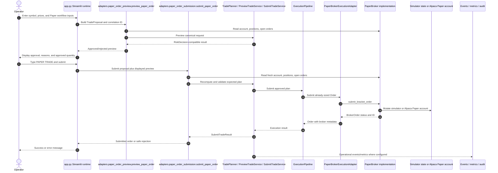

# V41-PQ-001E Current Paper Workflow Inventory

## 1. Scope and methodology

This inventory records the Paper runtime as confirmed from source code on branch
`feature/edutrader-v4.1` at starting HEAD
`e5b1f8b1e52c35fb7134071d68698c4812a14b49`.

The review inspected the current Streamlit runtime edge, manual Paper Order
composition adapters, scanner supervisor composition, root Paper broker protocol,
simulator and Alpaca Paper adapters, Volcanes execution adapter, operational
events, metrics, validation exports, and the V41-PQ-001 qualification package.

Behavior is classified as:

- Confirmed from source: directly visible in the referenced file and symbol.
- Inferred from tests: supported by existing tests or implementation reports.
- Unresolved: no current runtime capability was found.

No broker call, simulator workflow, credential access, or runtime workflow was
executed for this inventory.

## 2. Runtime entry points

Confirmed from source:

- `app.py` is the active Streamlit runtime entry point.
- `app.py` imports `preview_paper_order`, `approved_quantity_display`, and
  `submit_paper_order` for the manual Paper Order workflow.
- `app.py` imports `build_scanner_execution_runtime` for supervised scanner
  execution.
- `app.py` defines deterministic feature flags:
  `USE_DETERMINISTIC_PREVIEW`, `USE_DETERMINISTIC_SUBMISSION`, and
  `USE_DETERMINISTIC_SCANNER`.

There is no confirmed CLI entry point for the current Paper Order workflow in
the inspected source.

## 3. Application orchestration

Manual Paper Order orchestration currently starts in `app.py` under the
`Paper Order` page. The page creates a `trading.risk_manager.TradeProposal`,
creates a lifecycle correlation ID with `new_correlation_id()`, invokes
`adapters.paper_order_preview.preview_paper_order`, displays the resulting
legacy-compatible `RiskDecision`, and later invokes
`adapters.paper_order_submission.submit_paper_order` when the operator types the
confirmation phrase.

Scanner orchestration starts in `engine/supervised_brain.py` through
`SupervisedEduTraderBrain.run_cycle`. The scanner calls
`scanner_engine.automated_scanner.scan_market`, converts qualified signals into
`ExecutionRequest`, and routes them through `ExecutionSupervisor`. The runtime
composition for this stack is in `adapters/scanner_execution.py`.

## 4. Order-intent creation

Confirmed from source:

- Manual order intent is represented first as `TradeProposal` in `app.py`.
- `adapters.paper_order_composition.to_preview_request` translates
  `TradeProposal` into `PreviewTradeRequest` using canonical decimal prices,
  normalized trade side where possible, and a correlation ID.
- Scanner order intent is represented as `strategies.trend_momentum.StrategySignal`
  and converted by `SupervisedEduTraderBrain._to_execution_request` into an
  immutable `ExecutionRequest`.

The current Paper runtime does not create a `QualificationApplicationCommand`.
V41-PQ-001 qualification state is not yet connected to the Paper workflow.

## 5. Approval and confirmation behavior

Confirmed from source:

- Manual preview approval is calculated by `PreviewTradeService` when
  `USE_DETERMINISTIC_PREVIEW` is true, then converted back into a legacy
  `RiskDecision` by the preview adapter.
- Manual submission requires the exact operator confirmation phrase
  `"PAPER TRADE"` in `adapters.paper_order_submission.submit_paper_order`.
- Rejected previews display the approved quantity as `—` through
  `adapters.paper_order_presentation.approved_quantity_display`.
- Scanner automation approval is handled by `ExecutionSupervisor`; the scanner
  does not calculate sizing or approval itself.

Unresolved for V41-PQ-001E:

- There is no current operator approval event mapped to
  `QualificationEventType.OPERATOR_APPROVED`.
- There is no qualification-run approval screen or qualification-specific
  approval boundary.

## 6. Paper/Live environment selection

Confirmed from source:

- `app.py` exposes only `Local Simulator` and `Alpaca Paper` in the selected
  broker mode.
- `broker.alpaca_paper.AlpacaPaperBroker` constructs `TradingClient(...,
  paper=True)`.
- `adapters.paper_broker_execution.PaperBrokerExecutionAdapter` rejects brokers
  where `broker.is_paper` is false.
- `volcanoes.application.platform.configuration.validate_broker_runtime`
  validates broker runtime configuration.

Live behavior is not implemented through the Paper workflow in the inspected
source, and V41-PQ-001 integration must preserve that isolation.

## 7. Broker abstraction

Confirmed from source:

- `broker.base.PaperBroker` is the root runtime protocol.
- It exposes read methods: `get_account`, `get_positions`, and
  `get_open_orders`.
- It exposes write methods: `submit_bracket_order`, `cancel_all_orders`, and
  `close_all_positions`.
- It does not expose a targeted order lookup, targeted cancellation, replace
  order, order-status history, fill history, or broker request idempotency query.

Qualification relevance:

- Existing `PaperBroker` can support submission and coarse emergency cleanup.
- It is insufficient by itself for qualification reconciliation that requires
  targeted proof about one qualification order.

## 8. Simulated broker behavior

Confirmed from source:

- `broker.simulated.SimulatedPaperBroker` persists mutable runtime state to
  `state/simulated_broker.json` by default.
- `submit_bracket_order` creates a `BrokerOrder` with status `accepted`,
  appends it to broker state, and writes the state file.
- `cancel_all_orders` marks open/new/accepted orders cancelled and writes state.
- `close_all_positions` clears positions and writes state.

`state/simulated_broker.json` is mutable operational state. It is not canonical
qualification evidence and must not be staged as part of V41-PQ-001E.

## 9. Order submission path

Confirmed from source:

- Manual deterministic submission enters
  `adapters.paper_order_submission.submit_paper_order`.
- The adapter rebuilds the same planner through
  `build_paper_order_planner`, copies the displayed preview into
  `ExpectedTradePlan`, and invokes `SubmitTradeService`.
- `SubmitTradeService` delegates approved order construction and submission to
  `ExecutionPipeline`.
- `ExecutionPipeline` uses `PaperBrokerExecutionAdapter` to submit the already
  sized Volcanes `Order` to the root `PaperBroker.submit_bracket_order`.
- If deterministic submission is disabled, the legacy callable
  `PaperExecutionEngine.submit` remains the rollback path.

V41-PQ-001 is not currently in this path.

## 10. Broker acknowledgment handling

Confirmed from source:

- `PaperBrokerExecutionAdapter.submit_order` copies `BrokerOrder.order_id`,
  `status`, and `message` into the Volcanes `Order`.
- Broker statuses `cancelled`, `canceled`, `expired`, and `rejected` map to
  `OrderStatus.REJECTED`.
- Broker status `filled` maps to `OrderStatus.FILLED`.
- Other statuses map to `OrderStatus.PENDING`.

Unresolved:

- A returned broker order is not the same as qualification proof that the
  request lifecycle completed.
- The root broker protocol does not expose a durable broker request identity
  independent of the returned order ID.

## 11. Cancellation path

Confirmed from source:

- `app.py` exposes emergency controls on the Paper Orders & Positions page.
- The controls call `broker.cancel_all_orders()` and
  `broker.close_all_positions()` directly.
- `PaperBroker` exposes only bulk cancellation and bulk position close methods.

Unresolved:

- There is no targeted cancellation method for a single qualification order.
- There is no qualification cancellation observation currently returned to
  `PaperQualificationService`.

## 12. Fill and partial-fill handling

Confirmed from source:

- `PaperBrokerExecutionAdapter` maps a returned `filled` status to
  `OrderStatus.FILLED`.
- `PaperBroker` does not expose fill events, partial-fill quantities, or
  execution history.

Unresolved:

- Partial-fill handling required by ADR-004 qualification states is not
  currently implemented in the Paper runtime boundary.
- Fill truth must not be inferred from local submission state.

## 13. Position verification

Confirmed from source:

- `BrokerPortfolioView.from_broker` copies positions into a read-only portfolio
  view for deterministic risk planning.
- `PaperBrokerExecutionAdapter.get_position_quantity` sums current broker
  positions for a symbol.
- `app.py` displays broker positions and exposes bulk close controls.

Unresolved:

- No qualification-specific no-position verification path exists yet.
- Current position reads can support future normalized observations but do not
  establish durable evidence by themselves.

## 14. Reconciliation behavior

Confirmed from source:

- Operational validation scripts and docs reconcile exported metrics with
  broker/simulator evidence.
- `SubmitTradeService` prevents preview/submission drift by replanning from a
  fresh snapshot before submission.
- `ExecutionSupervisor` manages process-local duplicate and symbol-lock
  decisions for scanner execution.

Unresolved:

- There is no runtime reconciliation service that can resolve an uncertain
  qualification broker effect.
- There is no targeted root-broker order lookup suitable for
  `QualificationEventType.RECONCILIATION_RESOLVED`.

Classification: `MISSING_CURRENT_CAPABILITY`.

## 15. Retry and timeout behavior

Confirmed from source:

- `SubmitTradeService` contains duplicate-submission protection for one service
  process.
- `ExecutionSupervisor` contains process-local cooldown, duplicate execution,
  and same-symbol serialization policies.
- `PaperQualificationService` supports idempotency through repository-supplied
  prior command records.

Unresolved:

- No durable retry registry exists for qualification runtime integration.
- No targeted timeout policy for Paper qualification broker observation was
  found in the current Paper runtime.

## 16. Idempotency behavior

Confirmed from source:

- Manual deterministic submission compares the displayed preview to a freshly
  recomputed plan through `ExpectedTradePlan`.
- Scanner idempotency key is a SHA-256 digest of scanner mode, symbol, entry,
  stop, and target in `SupervisedEduTraderBrain._to_execution_request`.
- `PaperQualificationService` does not own durable idempotency; it delegates
  prior-command lookup and recording to `QualificationRunRepository`.

Integration implication:

- V41-PQ-001F can use qualification idempotency only within the repository
  implementation it is given.
- Restart-safe qualification idempotency remains deferred to V41-PQ-002.

## 17. Evidence and event publishing

Confirmed from source:

- `volcanoes.events` defines immutable operational domain events.
- `NullEventPublisher` accepts events without external side effects.
- `OperationalEventPublisher` counts publication attempts.
- `volcanoes.application.operations.validation.export_validation_snapshot`
  writes sanitized operator-triggered JSON exports.
- `audit.trade_log.AuditLog` writes JSONL scanner audit events.
- V41-PQ-001D adds canonical qualification evidence records through the
  `QualificationEvidenceRecorder` port.

Integration implication:

- Canonical qualification evidence must be authoritative for qualification
  state.
- Existing metrics, events, and audit logs may coexist as operational
  observability, but must not be treated as qualification state or durable proof
  unless explicitly recorded as qualification evidence.

## 18. Logging and diagnostics

Confirmed from source:

- Preview parity diagnostics log differences in development mode without
  changing the active deterministic preview.
- Scanner writes JSONL audit rows through `AuditLog`.
- Operational metrics count previews, approvals, rejections, submissions,
  broker failures, drift, idempotency, duplicate executions, scanner decisions,
  event publication attempts, and instrumentation failures.

## 19. Emergency-stop behavior

Confirmed from source:

- `app.py` has bulk emergency controls for cancelling all Paper orders and
  closing all Paper positions.
- ADR-004 and the qualification state machine include
  `Guard.EMERGENCY_STOP_INACTIVE`.
- `scenario_catalog.emergency_stop_scenario` models emergency stop as a
  qualification safety scenario.

Unresolved:

- There is no single runtime kill-switch service or global emergency-stop source
  currently read before every Paper side effect.
- Future integration must evaluate emergency stop before accepting commands that
  can lead to side effects and again immediately before executing a side effect.

## 20. Persistence and state ownership

Confirmed from source:

- Simulator runtime state is owned by `broker.simulated.SimulatedPaperBroker`.
- Operational validation artifacts live under `build/validation`.
- V41-PQ-001 service uses abstract `QualificationRunRepository` and
  `QualificationEvidenceRecorder` ports.
- In-memory qualification repositories exist for tests and harnesses only.

Unresolved:

- No production qualification persistence exists.
- Restart recovery and durable evidence remain deferred to V41-PQ-002.

## 21. Error propagation

Confirmed from source:

- Manual deterministic submission raises `PermissionError` on missing operator
  confirmation and `ValueError` when `SubmitTradeService` rejects submission.
- `PaperBrokerExecutionAdapter` raises `ValueError` for non-buy orders or
  missing bracket prices and rejects non-Paper brokers at construction.
- `PaperQualificationService` returns structured application results for
  domain rejections and raises safe application-layer errors for port failures.

Future integration must translate uncertainty into `UNRESOLVED` or
`RECONCILIATION_REQUIRED`, not ordinary success.

## 22. Current test coverage

Inferred from implementation reports and test names:

- V41-PQ-001A through V41-PQ-001D have focused qualification tests.
- Existing Paper preview, submission, architecture, scanner, and operational
  validation tests cover deterministic runtime behavior.
- No test currently proves qualification runtime integration because that
  integration does not yet exist.

## 23. Legacy assumptions

- `PaperExecutionEngine.submit` remains as a rollback path.
- `RiskDecision` remains the presentation-compatible manual preview model.
- The root `PaperBroker` protocol is still the outer broker boundary.
- Bulk emergency controls are operational controls, not qualification-specific
  reconciliation.

## 24. Known ambiguity

- Targeted order lookup and targeted cancellation are missing from the current
  broker protocol.
- Partial-fill and status-history observation are unresolved.
- Durable qualification idempotency and restart recovery are deferred.
- Emergency-stop source of truth is not a single central runtime service.

## 25. Integration-relevant symbol inventory

| Component | Path | Symbol | Current responsibility | External effect | State owner | Qualification relevance | Proposed future status |
|---|---|---|---|---|---|---|---|
| Streamlit runtime | `app.py` | `page == "Paper Order"` | Manual Paper preview/submission UI | May trigger broker submission through adapter | Streamlit session/runtime | Current manual entry point | WRAP through facade after feature flag |
| Feature flags | `app.py` | `USE_DETERMINISTIC_PREVIEW`, `USE_DETERMINISTIC_SUBMISSION`, `USE_DETERMINISTIC_SCANNER` | Select deterministic v4 paths | None directly | Runtime module constants | Existing rollout precedent | RETAIN; add separate qualification flag later |
| Preview adapter | `adapters/paper_order_preview.py` | `preview_paper_order` | Select legacy vs deterministic preview | Reads broker account/orders | None | Existing preview boundary | WRAP or SHADOW for qualification prechecks |
| Submission adapter | `adapters/paper_order_submission.py` | `submit_paper_order` | Select legacy vs deterministic submission | May submit broker order | Broker adapter/state | Existing consequential boundary | WRAP; do not bypass qualification facade |
| Planner composition | `adapters/paper_order_composition.py` | `build_paper_order_planner` | Build policy-parity planner | None | None | Must remain source of trading plan | RETAIN |
| Presentation helper | `adapters/paper_order_presentation.py` | `approved_quantity_display` | Safe rejected quantity display | None | None | Operator clarity | RETAIN |
| Root broker protocol | `broker/base.py` | `PaperBroker` | Runtime Paper broker abstraction | Submit/cancel/close through implementations | Broker implementation | Existing broker boundary | WRAP; do not import into qualification core |
| Simulator | `broker/simulated.py` | `SimulatedPaperBroker` | Local Paper-safe broker | Writes simulator state | `state/simulated_broker.json` | Development/test runtime | DO_NOT_TOUCH in V41-PQ-001E |
| Alpaca Paper | `broker/alpaca_paper.py` | `AlpacaPaperBroker` | Alpaca Paper adapter | Read/submit/cancel/close via Paper SDK | Alpaca Paper account | Paper-only external adapter | WRAP with Paper-only qualification executor |
| Volcanes broker adapter | `adapters/paper_broker_execution.py` | `PaperBrokerExecutionAdapter` | Translate Volcanes order to root broker | Submits bracket order | Root broker | Existing execution adapter | WRAP through side-effect executor |
| Submit service | `volcanoes/application/services/submit_trade.py` | `SubmitTradeService` | Deterministic submission service | Delegates to pipeline | Process-local duplicate registry | Existing execution service | RETAIN; qualification may call through executor |
| Execution pipeline | `volcanoes/execution/execution_pipeline.py` | `ExecutionPipeline` | Build and submit approved orders | Calls Volcanes broker port | Broker port | Existing deterministic execution | RETAIN |
| Scanner brain | `engine/supervised_brain.py` | `SupervisedEduTraderBrain.run_cycle` | Convert scanner signals to supervisor requests | May submit through supervisor | Audit log/metrics | Automated Paper path | DO_NOT_TOUCH for first manual qualification slice |
| Scanner runtime | `adapters/scanner_execution.py` | `build_scanner_execution_runtime` | Compose scanner supervisor/services | Creates execution adapter | Runtime process | Existing supervised scanner integration | DO_NOT_TOUCH in first slice |
| Qualification service | `volcanoes/application/qualification/service.py` | `PaperQualificationService.execute` | Own qualification state transitions around pure engine | Records via abstract ports only | Repository port | Target authoritative qualification boundary | REPLACE ad hoc qualification procedure |
| Qualification evidence | `volcanoes/application/qualification/evidence.py` | `QualificationEvidenceRecord` | Canonical redacted evidence model | None by itself | Evidence recorder | Authoritative qualification evidence | RETAIN |
| Operational events | `volcanoes/events/publisher.py` | `NullEventPublisher` | Event publisher interface/no-op default | No-op by default | None | Observability only | RETAIN; not qualification authority |
| Operational metrics | `volcanoes/application/operations/metrics.py` | `ProcessLocalOperationalMetrics` | Process-local counters/latencies | In-memory mutation | Runtime process | Observability | RETAIN |
| Scanner audit | `audit/trade_log.py` | `AuditLog.write` | JSONL scanner audit | Writes JSONL | `logs/automation_audit.jsonl` | Operational audit only | RETAIN separately |

## Current workflow diagram

