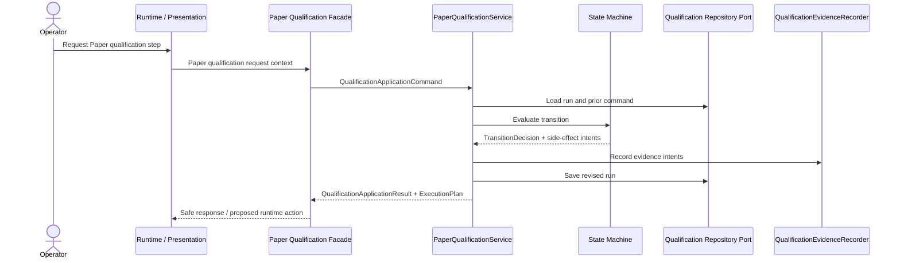
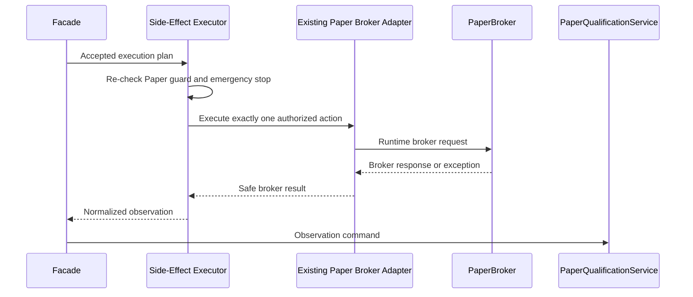
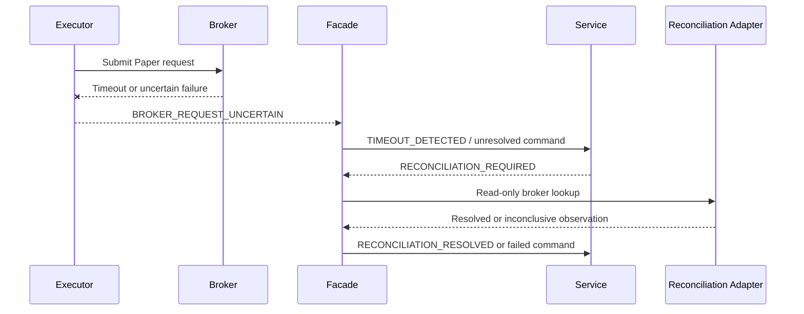
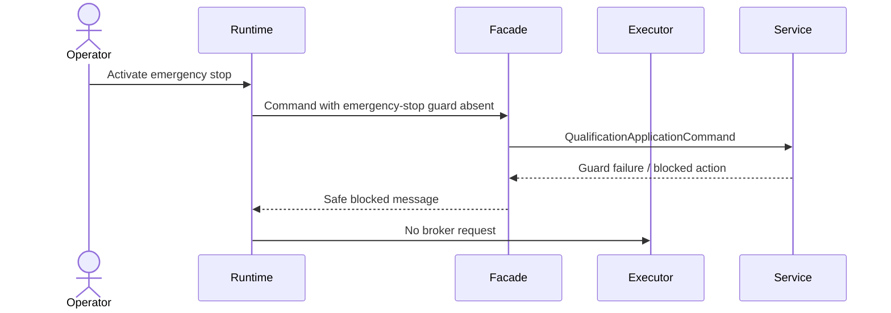
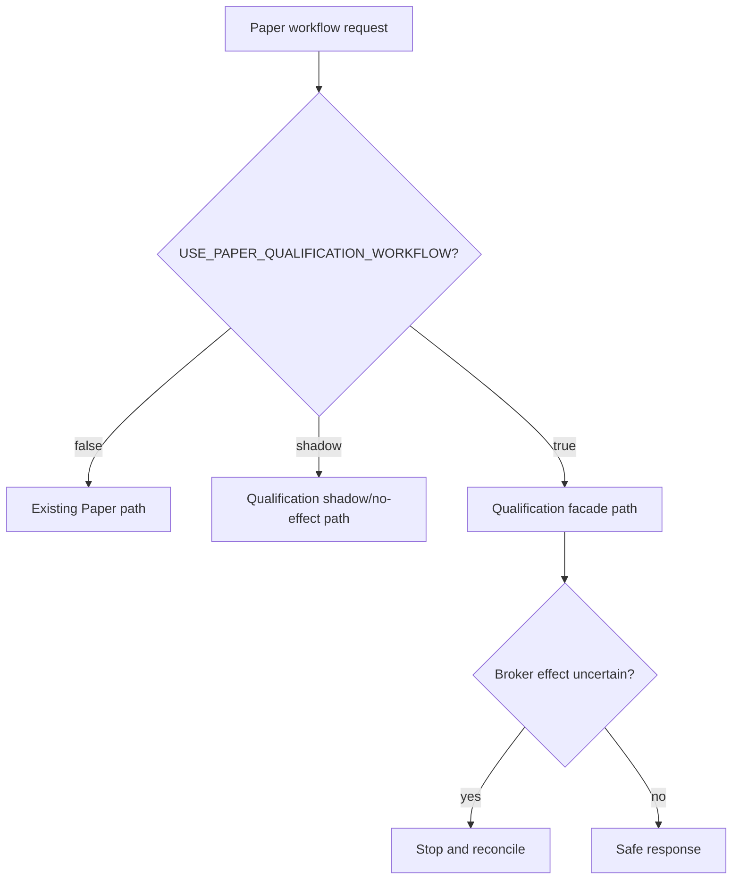

# V41-PQ-001E Implementation Plan

## Purpose

This plan breaks the future Paper qualification workflow integration into small,
reversible implementation slices. It does not authorize runtime integration by
itself and does not change current Paper behavior.

Recommended first slice: **V41-PQ-001F1 — Integration contracts**.

## V41-PQ-001F1 — Integration contracts

Purpose:

- Define presentation-neutral contracts for Paper qualification integration.
- Preserve Paper-only identity, run identity, command identity, correlation ID,
  idempotency key, and safe response mapping.
- Introduce no broker effects.

Affected files likely:

- `volcanoes/application/qualification/` new contract module or existing public
  contracts.
- `tests/test_architecture_dependencies.py`
- New focused contract tests.

Excluded behavior:

- No broker submission.
- No cancellation.
- No Streamlit wiring.
- No persistence implementation.
- No simulator mutation.

Required tests:

- contract immutability;
- Paper-only validation;
- no broker imports in qualification core;
- no Streamlit imports in application contracts;
- command identity/correlation preservation.

Rollback:

- Remove the isolated contract module and tests.

Acceptance criteria:

- Existing verification baseline preserved.
- No production Paper workflow behavior changed.
- Architecture rules remain green.

Proposed commit subject:

`feat(qualification): add Paper workflow integration contracts`

## V41-PQ-001F2 — Paper Qualification Facade

Purpose:

- Add a narrow facade that translates existing Paper workflow inputs into
  `QualificationApplicationCommand`.
- Invoke `PaperQualificationService`.
- Return safe qualification outcomes without executing broker effects.

Affected files likely:

- New facade module outside the pure state machine.
- Qualification integration tests.
- Architecture tests.

Excluded behavior:

- No side-effect executor.
- No broker submission or cancellation.
- No UI cutover.

Required tests:

- facade invokes `PaperQualificationService`;
- facade does not mutate runs directly;
- replay/conflict behavior passes through service;
- Paper-only guard;
- emergency-stop guard input mapping.

Rollback:

- Disable/remove facade; no runtime path depends on it yet.

Acceptance criteria:

- Facade is not a second state machine.
- All qualification state changes go through service.

Proposed commit subject:

`feat(qualification): add Paper qualification facade`

## V41-PQ-001F3 — Shadow-mode invocation

Purpose:

- Invoke qualification facade in read-only/shadow mode from the Paper workflow
  without changing preview/submission behavior.
- Record no authoritative runtime outcome from shadow-only information.

Affected files likely:

- `app.py` only if separately authorized.
- Paper order adapter composition.
- Platform health/diagnostics if flag reporting is needed.

Excluded behavior:

- No broker effects from qualification path.
- No legacy behavior change.
- No qualification pass based only on shadow results.

Required tests:

- flag default false/fail closed;
- shadow invocation creates no broker order;
- existing Paper UI behavior unchanged;
- qualification errors do not submit or cancel.

Rollback:

- Disable `USE_PAPER_QUALIFICATION_WORKFLOW`.

Acceptance criteria:

- No broker order increase under shadow mode.
- Existing Paper regression tests pass.

Proposed commit subject:

`feat(qualification): shadow Paper workflow qualification`

## V41-PQ-001F4 — Side-effect executor

Purpose:

- Add a side-effect executor that can translate an accepted
  `QualificationExecutionPlan` into exactly one runtime action.
- Initially support only `PREPARE_BROKER_SUBMISSION` and blocked responses; add
  `SEND_BROKER_REQUEST` only after duplicate-effect controls are tested.

Affected files likely:

- New adapter module near Paper runtime adapters.
- Contract tests with fake brokers.
- Architecture tests.

Excluded behavior:

- No targeted cancellation yet.
- No reconciliation finalization.
- No scanner integration.

Required tests:

- one-and-only-one broker submission;
- no submission without accepted service plan;
- uncertain send becomes unresolved;
- no blind retry;
- Paper-only broker guard;
- emergency-stop re-check.

Rollback:

- Disable executor flag; preserve active run; do not fall back after uncertain
  send.

Acceptance criteria:

- Duplicate submission risk controlled.
- Live broker refusal proven.

Proposed commit subject:

`feat(qualification): add guarded Paper side-effect executor`

## V41-PQ-001F5 — Broker observation normalization

Purpose:

- Normalize broker acknowledgments, rejections, order status, position status,
  and safe object references into qualification observation commands.

Affected files likely:

- New observation normalization adapter.
- Broker fake tests.
- Qualification scenario tests.

Excluded behavior:

- No durable persistence.
- No broad scanner integration.

Required tests:

- acknowledged/rejected/uncertain observations;
- stale observation rejection;
- out-of-order observation rejection;
- duplicate observation replay;
- no raw broker payloads in contracts.

Rollback:

- Stop observation processing and require manual reconciliation for active runs.

Acceptance criteria:

- Observation never mutates qualification state outside
  `PaperQualificationService`.

Proposed commit subject:

`feat(qualification): normalize Paper broker observations`

## V41-PQ-001F6 — Reconciliation integration

Purpose:

- Add a read-only reconciliation path for uncertain broker effects.
- Resolve or preserve inconclusive qualification state through normalized
  observations.

Affected files likely:

- Reconciliation adapter.
- Broker protocol extension or dedicated observation port, if separately
  approved.
- Failure-injection tests.

Excluded behavior:

- No database selection.
- No live trading.

Required tests:

- order absent/open/remains;
- no-position/position-exists;
- partial-fill/fill if supported;
- timeout-to-unresolved;
- reconciliation inconclusive;
- no blind retry.

Rollback:

- Stop new qualification starts; preserve unresolved runs; require operator
  review.

Acceptance criteria:

- Missing broker truth never becomes success.

Proposed commit subject:

`feat(qualification): add Paper reconciliation observations`

## V41-PQ-001F7 — Evidence coexistence

Purpose:

- Integrate canonical qualification evidence with existing operational
  metrics/events without making operational events authoritative.

Affected files likely:

- Qualification evidence recorder adapter.
- Operational diagnostics.
- Evidence tests.

Excluded behavior:

- No durable event publisher unless separately approved.
- No database.

Required tests:

- canonical evidence hash;
- redaction;
- correlation chain;
- replay evidence suppression;
- operational event/evidence consistency checks.

Rollback:

- Disable qualification evidence adapter and block consequential qualification
  finalization.

Acceptance criteria:

- Qualification evidence is authoritative and redacted.

Proposed commit subject:

`feat(qualification): integrate canonical Paper qualification evidence`

## V41-PQ-001F8 — Legacy-path retirement

Purpose:

- Retire or contain legacy/manual compatibility paths only after qualification
  acceptance proves parity and rollback is no longer needed.

Affected files likely:

- Paper order composition.
- Feature flags.
- Documentation.
- Regression tests.

Excluded behavior:

- No deletion before acceptance evidence.
- No scanner migration unless separately authorized.

Required tests:

- rollback removal criteria;
- no legacy double-submit path;
- qualification end-to-end acceptance;
- UI/presentation regression tests.

Rollback:

- Restore prior compatibility layer from version control if retirement proves
  unsafe.

Acceptance criteria:

- Qualification path accepted end-to-end.
- No active non-terminal runs rely on legacy behavior.

Proposed commit subject:

`refactor(qualification): retire legacy Paper qualification compatibility path`

## Target sequence diagrams

### Proposed qualification-integrated command flow

### Side-effect execution and observation return

### Uncertain submission and reconciliation flow

### Emergency-stop blocking flow

### Feature-flag rollout and rollback

## Final implementation recommendation

Proceed only with V41-PQ-001F1 next. It is the safest first slice because it
creates the translation language needed for integration while preserving the
release rule that no broker effects, runtime behavior, policies, sizing, or
execution logic change until the side-effect and observation boundaries are
tested.
