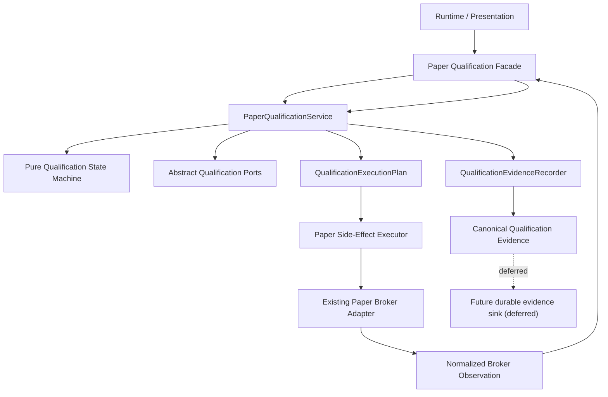

# V41-PQ-001E Integration Architecture Review

## 1. Executive summary

V41-PQ-001A through V41-PQ-001D implemented the Paper qualification state
machine, application service, scenario harness, and canonical evidence adapter.
They are not connected to the current Paper runtime.

The current Paper runtime already has a safe deterministic trading stack:
Streamlit calls outer adapters, outer adapters invoke application services,
application services use `TradePlanner`, and order side effects pass through
`ExecutionPipeline` and `PaperBrokerExecutionAdapter`.

The recommended integration is a narrow Paper Qualification Facade plus a
separate side-effect executor. The facade should translate current Paper
workflow requests into `QualificationApplicationCommand` objects, invoke
`PaperQualificationService`, and hand accepted `QualificationExecutionPlan`
intents to a side-effect executor. The executor may call existing Paper runtime
capabilities, but must return normalized broker observations back into
`PaperQualificationService`. No component may mutate qualification state
directly or treat a side-effect intent as proof that the side effect occurred.

Disposition: **ACCEPTED WITH CONDITIONS**.

The next implementation slice should introduce contracts and Paper-only
compatibility adapters only. It should not submit or cancel broker orders.

## 2. Review status

| Field | Value |
|---|---|
| Review item | V41-PQ-001E |
| Status | Architecture review completed |
| Repository branch | `feature/edutrader-v4.1` |
| Starting HEAD | `e5b1f8b1e52c35fb7134071d68698c4812a14b49` |
| ADR status | ADR-004 remains Accepted |
| Runtime behavior changed | No |
| Production code changed | No |
| Tests changed | No |

## 3. Scope

In scope:

- Current Paper workflow discovery.
- Integration boundary design.
- Side-effect intent mapping.
- Broker-observation normalization design.
- Evidence coexistence design.
- Ownership matrix.
- Rollout, rollback, failure-containment, and test strategy.

## 4. Exclusions

Out of scope:

- Runtime integration.
- Broker calls.
- Credential access.
- New feature flags in code.
- Production persistence.
- Cross-process coordination.
- Live trading.
- Changes to current Paper Order behavior.

## 5. Authoritative references

- `docs/adr/ADR-004-PAPER-QUALIFICATION-STATE-MACHINE.md`
- `docs/engineering/V41_PQ_001_DESIGN.md`
- `docs/engineering/V41_PQ_001_TRANSITION_TABLE.md`
- `docs/engineering/V41_PQ_001_TEST_STRATEGY.md`
- `docs/engineering/V41_PQ_001A_IMPLEMENTATION_REPORT.md`
- `docs/engineering/V41_PQ_001B_IMPLEMENTATION_REPORT.md`
- `docs/engineering/V41_PQ_001C_IMPLEMENTATION_REPORT.md`
- `docs/engineering/V41_PQ_001D_IMPLEMENTATION_REPORT.md`
- `docs/reviews/SENTINEL_ADR_004_REVIEW.md`

## 6. Current architecture summary

Confirmed from source:

- `app.py` owns the Streamlit Paper runtime entry point.
- `adapters.paper_order_preview.preview_paper_order` composes deterministic
  preview through `PreviewTradeService`.
- `adapters.paper_order_submission.submit_paper_order` composes deterministic
  submission through `SubmitTradeService` and `ExecutionPipeline`.
- `adapters.paper_order_composition.build_paper_order_planner` builds the shared
  policy-parity `TradePlanner`.
- `broker.base.PaperBroker` is the root Paper broker protocol.
- `adapters.paper_broker_execution.PaperBrokerExecutionAdapter` translates
  Volcanes orders into root broker bracket orders and rejects non-Paper brokers.
- `engine.supervised_brain.SupervisedEduTraderBrain` turns scanner signals into
  `ExecutionRequest` and routes them through `ExecutionSupervisor`.

V41-PQ-001 qualification code is not currently part of this runtime path.

## 7. Qualification subsystem summary

Confirmed from source:

- `volcanoes.application.qualification.contracts` defines immutable run,
  command, event, guard, transition, side-effect, evidence-intent, and result
  contracts.
- `volcanoes.application.qualification.state_machine` owns transition legality.
- `volcanoes.application.qualification.service.PaperQualificationService`
  orchestrates commands, revision checks, idempotency records, state saves, and
  evidence recording through abstract ports.
- `QualificationExecutionPlan` is descriptive and does not execute effects.
- `volcanoes.application.qualification.evidence` builds canonical redacted
  qualification evidence records.
- `volcanoes.application.qualification.in_memory` exists for tests/harness use;
  it is not production persistence.

## 8. Proposed target architecture

## 9. Integration principles

1. `PaperQualificationService` is the only qualification state mutation path.
2. Side-effect intents are descriptions, not proof.
3. Broker truth returns only as normalized observations.
4. Paper-only guards must be enforced at runtime boundaries.
5. Canonical qualification evidence is authoritative for qualification.
6. Current operational metrics/events remain observability, not qualification
   state.
7. V41-PQ-002 owns durable persistence and restart recovery.
8. Initial integration must be feature-flagged and fail closed.

## 10. Recommended insertion points

Primary insertion point:

- Between `app.py` and the existing manual Paper submission adapter, through a
  new Paper Qualification Facade.

Secondary insertion point after manual parity:

- Scanner automation may later route qualification-specific requests through the
  same facade. It should not be included in the first integration slice.

Do not insert qualification logic inside:

- `volcanoes.application.qualification.state_machine`
- `volcanoes.application.qualification.service`
- `volcanoes.application.qualification.evidence`
- `ExecutionPipeline`
- concrete broker adapters

## 11. Command flow

Target command flow:

1. Runtime creates qualification request context.
2. Facade creates `QualificationApplicationCommand`.
3. Facade calls `PaperQualificationService.execute`.
4. Service returns `QualificationApplicationResult` and
   `QualificationExecutionPlan`.
5. Facade checks plan kind and feature-flag state.
6. Side-effect executor executes exactly one approved runtime action where
   authorized.
7. Executor returns normalized broker observation.
8. Facade converts observation into the next qualification command.
9. Service records state/evidence through ports.
10. Runtime receives a safe response.

## 12. Side-effect-plan execution boundary

The side-effect executor must be outside the qualification core. It may import
root Paper broker and runtime adapters. It must not calculate risk, size trades,
decide transition legality, mutate qualification state, serialize canonical
evidence, or infer broker truth.

| Intent | Current possible capability | Safe in first code slice? | Notes |
|---|---|---:|---|
| `REQUEST_OPERATOR_APPROVAL` | Streamlit confirmation UI in `app.py` | Yes, as contract only | No runtime wiring in F1 |
| `RECORD_OPERATOR_APPROVAL` | Qualification command to service | Yes, as contract only | Must preserve command identity |
| `PREPARE_BROKER_SUBMISSION` | Existing deterministic preview/submission request translation | Yes, as adapter contract | No broker effect |
| `SEND_BROKER_REQUEST` | `PaperBrokerExecutionAdapter.submit_order` | No | Requires duplicate-effect and Paper guard tests |
| `REQUEST_BROKER_CANCELLATION` | Only `PaperBroker.cancel_all_orders` exists | No | Targeted cancellation missing |
| `START_RECONCILIATION` | No targeted runtime reconciliation service found | No | Missing current capability |
| `FINALIZE_QUALIFICATION` | `PaperQualificationService` command | Yes, no broker effect | Requires complete evidence |
| `BLOCK_CONSEQUENTIAL_ACTION` | Runtime safe response | Yes | Must not fall through to legacy submit |

## 13. Broker-observation return path

Normalized observations should be data-only contracts. Proposed observation
types:

- `BROKER_REQUEST_ACKNOWLEDGED`
- `BROKER_REQUEST_REJECTED`
- `BROKER_REQUEST_UNCERTAIN`
- `ORDER_CANCELLED`
- `CANCELLATION_REJECTED`
- `ORDER_ABSENT`
- `OPEN_ORDER_REMAINS`
- `NO_POSITION_EXISTS`
- `POSITION_EXISTS`
- `PARTIAL_FILL_REPORTED`
- `FILL_REPORTED`
- `RECONCILIATION_RESOLVED`
- `RECONCILIATION_INCONCLUSIVE`

Each observation must carry qualification run ID, scenario ID, correlation ID,
command ID, idempotency key, safe object reference, normalized facts, and no raw
broker payload.

Stale observations must be rejected through expected revision checks. Duplicate
observations must replay through qualification idempotency only when payload
identity matches.

## 14. Evidence integration

Canonical qualification evidence should not wrap existing operational events as
though those events were durable evidence. Instead:

- `QualificationEvidenceRecorder` records canonical qualification evidence.
- Existing operational events and metrics continue as observability.
- Existing scanner `AuditLog` continues as scanner audit.
- Correlation IDs should align across runtime, operational events, and
  qualification evidence.
- If both operational event and qualification evidence exist for the same step,
  qualification evidence is authoritative for qualification state.

## 15. Repository and persistence boundary

V41-PQ-001F can safely introduce contract-level integration and read-only/shadow
integration without durable persistence.

V41-PQ-001F must not claim:

- restart-safe qualification execution;
- durable command idempotency;
- durable evidence storage;
- crash recovery after an uncertain broker request.

V41-PQ-002 remains responsible for production persistence.

## 16. Idempotency ownership

| Concern | Owner |
|---|---|
| Qualification command idempotency | `QualificationRunRepository` through `PaperQualificationService` |
| Scanner execution idempotency | `ExecutionSupervisor` |
| Manual preview/submission drift check | `SubmitTradeService` |
| Broker request idempotency | Unresolved in current root broker protocol |

The facade must preserve command and idempotency identities but must not become a
second idempotency state store.

## 17. Revision ownership

`PaperQualificationService` and the state machine own qualification revision.
Runtime components supply expected revision but do not increment it directly.

## 18. Reconciliation ownership

The qualification subsystem owns when reconciliation is required. A future
reconciliation adapter owns how broker state is read. The current runtime lacks
targeted order lookup and status history, so reconciliation execution is a
missing current capability.

## 19. Emergency-stop ownership

ADR-004 owns the guard requirement. Runtime must provide the guard fact.

Future integration must evaluate emergency stop:

- before accepting a qualification command that can lead to a side effect;
- immediately before executing broker submission;
- immediately before cancellation;
- before retrying;
- before finalization if incomplete broker state exists.

Current bulk controls in `app.py` are not a central emergency-stop source.

## 20. Operator-approval ownership

The runtime owns presentation of approval prompts. The qualification subsystem
owns recording approval as a state-machine event. The side-effect executor must
not execute broker submission without a service result that proposes the
appropriate broker action after approval.

## 21. Paper/Live isolation

Controls required:

- New facade constructor accepts only Paper runtime context.
- Runtime context checks `broker.is_paper`.
- Alpaca Paper adapter remains `TradingClient(..., paper=True)`.
- Non-Paper brokers fail before command execution and before side-effect
  execution.
- Architecture tests prevent qualification core imports of broker adapters.
- Negative integration tests prove live endpoint and non-Paper broker refusal.

Live behavior remains unchanged because no Live adapter is introduced or routed
through V41-PQ-001.

## 22. Compatibility strategy

Use a compatibility adapter, not direct mutation of existing runtime functions.
The adapter should translate current Paper runtime objects into qualification
commands and translate qualification outcomes into existing runtime responses.

## 23. Dual-path and shadow-mode analysis

| Option | Assessment |
|---|---|
| Hard cutover | Too risky before observation normalization and duplicate-effect tests |
| Feature-flagged cutover | Required for consequential runtime integration |
| Shadow qualification | Best early runtime proof, provided it cannot submit/cancel |
| Dual-write evidence | Risky; only qualification evidence should be authoritative |
| Read-only qualification observation | Suitable for F2/F3 |
| Per-scenario enablement | Recommended |
| Per-environment enablement | Required; Paper only |

Recommended rollout: contracts first, then read-only/shadow, then
feature-flagged Paper-only execution for one scenario.

## 24. Rollout strategy

Proposed feature flag design, not implemented in this phase:

| Field | Recommendation |
|---|---|
| Name | `USE_PAPER_QUALIFICATION_WORKFLOW` |
| Default | `False` until runtime safety tests pass |
| Scope | Paper-only runtime |
| Owner | Platform configuration |
| Evaluation point | Facade entry before any qualification side effect |
| Missing config | Fail closed |
| Rollback | Disable flag, preserve active runs/evidence |
| Observability | Platform health report and qualification result |
| Deletion criteria | Legacy path retirement after qualification acceptance |

## 25. Rollback strategy

Rollback must mean safe containment, not blind fallback.

- Before broker request: disable facade and return to legacy Paper path if no
  qualification run is active.
- After accepted qualification but before broker request: preserve run and stop.
- After uncertain broker request: stop and reconcile; do not submit through
  legacy fallback.
- After broker acknowledgment: preserve evidence and continue observation or
  cancellation path.
- On evidence-recorder failure: block consequential action.
- On schema incompatibility: block qualification and require operator review.

## 26. Failure containment

Uncertain external effects must transition to `UNRESOLVED` or
`RECONCILIATION_REQUIRED`. They must not be reported as success, ordinary
failure, or a reason to retry blindly.

## 27. Observability

Operational metrics should add qualification counters only in a later code
slice. V41-PQ-001E does not add counters. Future observability should show
current qualification state, result, correlation ID, evidence head hash, and
whether side effects are enabled.

## 28. Security and privacy

No raw broker payloads, API keys, secrets, account numbers, authorization
headers, or personal account metadata should enter qualification contracts or
canonical evidence. Existing redaction rules in V41-PQ-001D remain authoritative.

## 29. Performance considerations

The first integration slices should be low-latency because they are command
translation and service calls only. Broker observation and reconciliation can
add latency later and should be measured separately. No performance benchmark is
changed in V41-PQ-001E.

## 30. Test strategy

Future tests should include:

- architecture boundary tests;
- facade contract tests;
- Paper-only negative tests;
- feature-flag default/fail-closed tests;
- shadow-mode no-effect tests;
- one-and-only-one submission tests;
- one-and-only-one cancellation tests;
- broker acknowledgment normalization tests;
- uncertain submission tests;
- stale/out-of-order observation tests;
- idempotency replay/conflict tests;
- revision conflict tests;
- emergency-stop tests;
- evidence trace tests;
- rollback tests;
- existing Paper regression tests.

## 31. Migration sequencing

1. V41-PQ-001F1 — integration contracts and compatibility adapters.
2. V41-PQ-001F2 — Paper Qualification Facade.
3. V41-PQ-001F3 — shadow-mode invocation.
4. V41-PQ-001F4 — side-effect executor.
5. V41-PQ-001F5 — broker observation normalization.
6. V41-PQ-001F6 — reconciliation integration.
7. V41-PQ-001F7 — evidence coexistence.
8. V41-PQ-001F8 — legacy-path retirement.

## 32. Open decisions

- Whether root `PaperBroker` should gain targeted order lookup or whether a
  qualification-only observation adapter should own that capability.
- How targeted cancellation will be implemented without using bulk cancellation
  as proof for one run.
- Whether V41-PQ-001F consequential execution is allowed before V41-PQ-002
  persistence.
- What emergency-stop source becomes authoritative at runtime.

## 33. Recommendation

Proceed to V41-PQ-001F1 only. F1 should introduce contracts and compatibility
translation with no broker effects.

## 34. Acceptance criteria for implementation

Before production workflow code changes:

- no critical findings are open;
- blocking major findings are resolved or explicitly deferred for a no-effect
  slice;
- one authoritative owner exists per responsibility;
- Paper/Live refusal is tested;
- side-effect executor boundary is approved;
- observation normalization is approved;
- feature-flag strategy is approved;
- rollback behavior is approved;
- existing verification baseline is preserved.

## 35. Final review disposition

**ACCEPTED WITH CONDITIONS**

Conditions:

1. V41-PQ-001F1 must introduce no broker submission or cancellation.
2. The qualification facade must not bypass `PaperQualificationService`.
3. The side-effect executor must be separate from the facade and qualification
   core.
4. Targeted reconciliation and targeted cancellation gaps must be resolved
   before consequential qualification execution is enabled.
5. The feature flag must fail closed and be Paper-only.
6. V41-PQ-002 persistence limitations must remain visible to operators.
