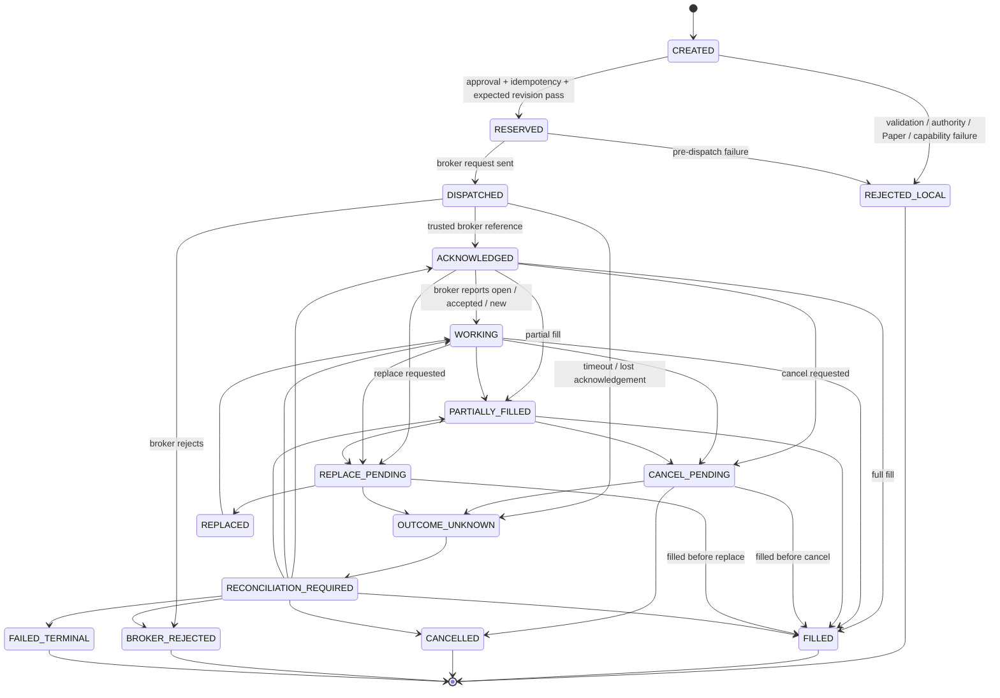

# V41-PQ-001F5A Execution Lifecycle

## Purpose

Define the future Paper execution lifecycle without implementing it. This
document separates execution state from qualification state and broker status.

## Lifecycle diagram

## State-transition table

| From | Event or command | Guard | To | Notes |
|---|---|---|---|---|
| `CREATED` | validate command | contract invalid | `REJECTED_LOCAL` | No broker dispatch. |
| `CREATED` | approve command | approval missing or stale | `REJECTED_LOCAL` | Readiness cannot satisfy this guard. |
| `CREATED` | reserve idempotency | Paper, approval, capability, revision pass | `RESERVED` | Reservation must be unique for command identity and payload. |
| `RESERVED` | dispatch submit | broker adapter accepts dispatch attempt | `DISPATCHED` | Request may now have crossed external boundary. |
| `RESERVED` | dispatch preparation fails | proven pre-dispatch | `REJECTED_LOCAL` | Safe local rollback may release reservation. |
| `DISPATCHED` | broker reference received | trusted reference present | `ACKNOWLEDGED` | Non-terminal. |
| `DISPATCHED` | broker rejects | safe rejection present | `BROKER_REJECTED` | Terminal unless broker-specific evidence says otherwise. |
| `DISPATCHED` | timeout or lost response | dispatch may have occurred | `OUTCOME_UNKNOWN` | Must not blindly retry. |
| `ACKNOWLEDGED` | status open/accepted/new | broker status trusted | `WORKING` | Non-terminal. |
| `ACKNOWLEDGED`/`WORKING` | partial fill | filled quantity below ordered quantity | `PARTIALLY_FILLED` | Remaining quantity may still be cancellable. |
| `ACKNOWLEDGED`/`WORKING`/`PARTIALLY_FILLED` | full fill | filled quantity equals order quantity | `FILLED` | Terminal. |
| `ACKNOWLEDGED`/`WORKING`/`PARTIALLY_FILLED` | cancel command | expected revision matches | `CANCEL_PENDING` | Cancellation does not undo fills. |
| `CANCEL_PENDING` | cancel confirmed | broker status cancelled | `CANCELLED` | Terminal for remaining quantity. |
| `CANCEL_PENDING` | fill observed | broker filled before cancel | `FILLED` | Fill truth wins. |
| `CANCEL_PENDING` | timeout | cancel outcome ambiguous | `OUTCOME_UNKNOWN` | Reconcile. |
| `ACKNOWLEDGED`/`WORKING`/`PARTIALLY_FILLED` | replace command | native replace supported | `REPLACE_PENDING` | No cancel-and-submit fallback initially. |
| `REPLACE_PENDING` | replace confirmed | replacement reference trusted | `REPLACED` | Lifecycle continues on replacement. |
| `REPLACE_PENDING` | fill observed | original filled before replace | `FILLED` | Fill truth wins. |
| `OUTCOME_UNKNOWN` | mark reconciliation | any ambiguity | `RECONCILIATION_REQUIRED` | No state-changing command until resolved. |
| `RECONCILIATION_REQUIRED` | reconcile consistent | broker truth known | matching non-terminal or terminal | Read-only. |
| any non-terminal | invariant/security/audit failure | unrecoverable | `FAILED_TERMINAL` | Operator action required. |

## Terminal and non-terminal states

Terminal states:

- `REJECTED_LOCAL`;
- `FILLED`;
- `CANCELLED`;
- `BROKER_REJECTED`;
- `FAILED_TERMINAL`.

Non-terminal states:

- `CREATED`;
- `RESERVED`;
- `DISPATCHED`;
- `ACKNOWLEDGED`;
- `WORKING`;
- `PARTIALLY_FILLED`;
- `CANCEL_PENDING`;
- `REPLACE_PENDING`;
- `REPLACED`;
- `OUTCOME_UNKNOWN`;
- `RECONCILIATION_REQUIRED`.

`OUTCOME_UNKNOWN` and `RECONCILIATION_REQUIRED` are non-terminal but
authority-restricted. They allow only query/reconcile activity until resolved.

## Allowed command-state combinations

| Operation | Allowed states | Prohibited states |
|---|---|---|
| `SUBMIT` | `CREATED` after local validation | Any state after `DISPATCHED`; terminal states; unknown/reconciliation states. |
| `CANCEL` | `ACKNOWLEDGED`, `WORKING`, `PARTIALLY_FILLED`, `REPLACED` | Before broker reference; terminal states; stale revision; unknown without reconciliation. |
| `REPLACE` | `ACKNOWLEDGED`, `WORKING`, `PARTIALLY_FILLED`, `REPLACED` when native replace supported | Any terminal state; unknown; unsupported capability; filled quantity exceeding new quantity. |
| `QUERY_STATUS` | Any state with a broker reference | None, because it is read-only, but result use is state-dependent. |
| `RECONCILE` | `OUTCOME_UNKNOWN`, `RECONCILIATION_REQUIRED`, startup recovery, post-error review | None, because it is read-only, but it may require broker reference or search keys. |

## Prohibited transitions

- `CREATED` directly to `FILLED`.
- `READY_FOR_NEXT_PHASE` to any execution state.
- `ACKNOWLEDGED` treated as `FILLED`.
- `OUTCOME_UNKNOWN` directly to another `SUBMIT`.
- `CANCELLED` back to `WORKING` without reconciliation evidence of broker
  error.
- `FILLED` to `CANCELLED`.
- `BROKER_REJECTED` to `WORKING` without a separate broker correction and
  operator action.
- `REPLACE_PENDING` to a new broker order created by cancel-and-submit fallback
  unless a later ADR explicitly authorizes that model.

## Recovery transitions

Recovery is read-first:

1. load durable command, revision, idempotency, receipt, and broker-reference
   history;
2. query broker by trusted broker reference and idempotency/client reference
   where supported;
3. compare broker state, fills, cancellation, replacement, and local expected
   state;
4. produce `PaperExecutionReconciliationResult`;
5. advance only through a permitted transition with evidence.

If reconciliation cannot prove a safe state, remain unresolved and require
operator action.

## Concurrency rules

- State-changing commands require expected execution revision.
- One logical execution may have only one in-flight state-changing command.
- Duplicate command identity and same payload replays the prior outcome.
- Same command identity with different payload fails as duplicate conflict.
- Same logical order with stale expected revision fails before dispatch.
- Broker events racing with local commands are resolved by reconciliation.
- Emergency stop prevents new commands after it becomes visible; if dispatch
  may already have occurred, reconcile before further action.
- Legacy and future executor authority must never submit the same logical order
  concurrently.
