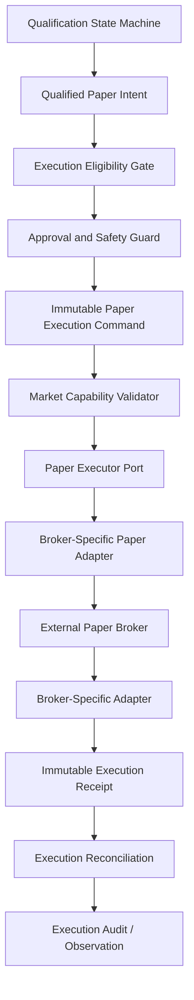

# V41-PQ-001F5A Paper Executor Architecture Review

## 1. Executive summary

V41-PQ-001F5A is an architecture review only. It defines how a future Paper
executor may transform a qualified, explicitly approved Paper intent into a
broker-facing request without giving qualification, readiness, shadow
observation, scanner automation, or runtime components implicit execution
authority.

Architecture-review decision: **ACCEPTED WITH CONDITIONS**.

The accepted design is a separate execution bounded context. Qualification may
produce immutable advisory facts and a qualified Paper intent. Readiness may
report whether evidence is sufficient for a next engineering slice. Neither
qualification nor readiness may submit, cancel, replace, or authorize an order.
Future Paper execution requires a separate explicit approval contract,
immutable execution command, deterministic idempotency key, expected execution
revision, Paper-only mode, market-capability validation, broker-port isolation,
auditable receipt, and reconciliation path for uncertain broker outcomes.

No executor was implemented in this slice.

## 2. Current-state architecture

Current repository facts reviewed:

- `docs/adr/ADR-004-PAPER-QUALIFICATION-STATE-MACHINE.md` accepts a Paper
  qualification state machine and explicitly does not authorize execution.
- `volcanoes/application/qualification/` contains the qualification state
  machine, contracts, service, scenario harness, and evidence adapter.
- `volcanoes/application/qualification/integration/` contains advisory
  integration contracts, shadow mode, runtime observation, validation, and
  readiness assessment.
- `adapters/paper_order_preview.py` contains the single production Paper
  shadow-observation call site. It calls
  `observe_paper_preview_decision()` only when
  `PaperQualificationShadowGate.ENABLED_OBSERVE_ONLY` is injected.
- `adapters/paper_order_submission.py` composes the existing deterministic
  manual Paper submission path through `SubmitTradeService`,
  `ExecutionPipeline`, and `PaperBrokerExecutionAdapter`.
- `adapters/scanner_execution.py` composes the supervised scanner path through
  `ExecutionSupervisor`, `PreviewTradeService`, and `SubmitTradeService`.
- `broker/base.py` defines the root `PaperBroker` protocol and mutable broker
  operations.
- `broker/alpaca_paper.py` is Paper-only by construction and initializes
  Alpaca with `TradingClient(..., paper=True)`.
- `broker/simulated.py` owns mutable local simulator state in
  `state/simulated_broker.json`.
- `volcanoes/execution/broker.py` defines the current Volcanes `Broker` port
  used by `ExecutionPipeline`.
- `volcanoes/execution/execution_pipeline.py` delegates sizing and risk
  planning to `TradePlanner` and submits an approved plan through the broker
  port.

Current execution exists for v4.0 deterministic Paper submission, but there is
no dedicated v4.1 Paper executor bounded context, no execution command
aggregate, no durable execution revision, no execution authorization contract,
no market-capability port, and no executor-specific reconciliation model.

## 3. Scope reviewed

Reviewed:

- qualification and readiness boundaries;
- current preview/submission/scanner composition;
- root Paper broker protocol;
- Volcanes broker port;
- Paper-only Alpaca adapter behavior;
- simulator mutability boundary;
- supervisor and submission duplicate-prevention behavior;
- event, metrics, health, and configuration safety posture;
- future executor authority, lifecycle, contracts, failures, retries,
  persistence, reconciliation, observability, and rollout.

## 4. Scope excluded

Excluded:

- production executor implementation;
- executable stubs or placeholder interfaces;
- broker calls;
- simulator state access through application code;
- runtime wiring;
- persistence implementation;
- event publisher implementation;
- retries implementation;
- Live support;
- scanner behavior changes;
- supervisor behavior changes;
- submission behavior changes;
- tests, unless an existing documentation fitness convention required them.

No such documentation fitness update was identified.

## 5. Key findings

1. Qualification and execution must remain separate bounded contexts.
2. The existing readiness decision `READY_FOR_NEXT_PHASE` is advisory only and
   must never become execution authority.
3. The existing deterministic services already demonstrate useful preview and
   submission invariants, but they do not replace the need for executor-level
   immutable commands, durable idempotency, revisions, or reconciliation.
4. The current root `PaperBroker` protocol exposes mutating operations, so any
   future executor must isolate broker calls behind a narrow Paper executor
   adapter and never import root broker types into qualification.
5. The simulator state file is mutable runtime state, not immutable execution
   evidence.
6. Broker acknowledgements, order working state, partial fills, fills,
   cancellations, and unknown outcomes require explicit modeling.
7. Live support should be structurally absent from initial execution contracts.
8. Market and venue rules should be isolated behind a capability layer instead
   of being embedded in qualification, readiness, strategy, or generic
   execution orchestration.

## 6. Proposed target architecture



Chosen dependency direction:

```text
UI / CLI / scanner / adapters
        ↓
application execution boundary
        ↓
paper execution bounded context
        ↓
broker-neutral ports
        ↓
broker-specific Paper adapters
```

Qualification and readiness remain parallel application concerns. They may
publish or expose immutable facts consumed by execution, but they must not
import, instantiate, or call executor ports.

## 7. Dependency direction

Accepted:

- `volcanoes/application/qualification` must not depend on execution.
- `volcanoes/application/qualification/integration/readiness.py` must not
  depend on execution.
- Future execution contracts may consume immutable qualified-intent data
  through a designated application boundary.
- Future adapters may import inward from application execution contracts.
- Broker adapters own translation to broker SDKs or root broker protocols.

Rejected:

- readiness invoking execution;
- qualification invoking brokers;
- scanners directly constructing broker orders;
- broker-specific validation inside qualification;
- Live endpoint or credential selection inside application contracts.

## 8. Bounded-context separation

Qualification answers: "Did this Paper-qualification scenario satisfy the
accepted qualification lifecycle and evidence criteria?"

Readiness answers: "Does observed evidence satisfy advisory criteria for the
next engineering phase?"

Execution answers: "May this approved Paper execution command be submitted,
cancelled, replaced, queried, or reconciled under its own authority, revision,
idempotency, capability, and broker-boundary rules?"

A qualified decision is not an execution command. A readiness assessment is not
execution authorization.

## 9. Execution authority model

Future authority must be explicit and separately represented.

Minimum initial requirements:

- static Paper-only system policy;
- explicit command-specific Paper approval;
- emergency-stop status checked fail-closed;
- execution revision consistency;
- deterministic idempotency reservation;
- market-capability acceptance;
- broker adapter proves Paper mode;
- risk/planner approval already present in the immutable qualified intent or
  command evidence.

Deferred:

- multi-user approval;
- portfolio committee approval;
- time-windowed strategy approval;
- account-level broker capability certification beyond Paper qualification;
- durable approval service;
- Live authority.

Execution status must not reuse qualification status. Future executor states
must distinguish at least: qualified, eligible for execution review, approved
for Paper execution, command created, submitted, broker acknowledged, partially
filled, filled, rejected, cancellation requested, cancelled, replace requested,
replaced, outcome unknown, reconciliation required, and terminal failure.

## 10. Execution lifecycle

The lifecycle is documented in
`docs/engineering/V41_PQ_001F5A_EXECUTION_LIFECYCLE.md`.

Summary:

1. create immutable intent;
2. evaluate eligibility;
3. record explicit approval;
4. create command;
5. validate idempotency and expected revision;
6. validate market capability;
7. reserve idempotency;
8. submit through Paper executor port;
9. normalize broker receipt;
10. reconcile until terminal, unresolved, or operator action required.

## 11. Proposed execution state model

Recommended smallest state model:

| State | Terminal | Purpose |
|---|---:|---|
| `CREATED` | No | Command exists but has not passed local checks. |
| `REJECTED_LOCAL` | Yes | Contract, authority, capability, Paper-mode, or revision check failed before dispatch. |
| `RESERVED` | No | Idempotency and expected revision were reserved before external dispatch. |
| `DISPATCHED` | No | Request crossed the broker boundary; acknowledgement is not yet trusted. |
| `ACKNOWLEDGED` | No | Broker accepted or recorded the order, but fill/cancel/replace outcome remains open. |
| `WORKING` | No | Broker reports active/accepted/new/open order state. |
| `PARTIALLY_FILLED` | No | Broker reports some fill quantity and leaves remaining quantity open or cancellable. |
| `FILLED` | Yes | Broker reports full fill. |
| `CANCEL_PENDING` | No | Cancellation requested; outcome not yet known. |
| `CANCELLED` | Yes | Broker confirms cancellation for remaining quantity. |
| `REPLACE_PENDING` | No | Replace requested; original/replacement relationship unresolved. |
| `REPLACED` | No | Broker confirms replacement; lifecycle continues on replacement reference. |
| `BROKER_REJECTED` | Yes | Broker rejects the order or operation. |
| `OUTCOME_UNKNOWN` | No | External outcome cannot be safely classified. |
| `RECONCILIATION_REQUIRED` | No | Read-only reconciliation is mandatory before any next state-changing command. |
| `FAILED_TERMINAL` | Yes | Nonrecoverable local invariant, security, or audit failure. |

`VALIDATED`, `APPROVAL_REQUIRED`, and `APPROVED` are better represented as
command facts and approval records instead of long-lived states. This keeps the
state model smaller and avoids overlap.

## 12. Command model

Supported future operations:

- `SUBMIT`;
- `CANCEL`;
- `REPLACE`, only where broker-native replace is explicitly supported;
- `QUERY_STATUS`, as a read port rather than a state-changing command;
- `RECONCILE`, as a read/reconciliation port rather than submission command.

Excluded:

- bulk liquidation;
- options exercise;
- complex multi-leg orders;
- Live operations;
- direct exchange access.

## 13. Receipt model

A receipt is an immutable broker-normalized fact. It may record transport
acceptance, broker order acceptance, broker rejection, working state, partial
fill, fill, cancellation acknowledgement, cancellation confirmation,
replacement acknowledgement, replacement confirmation, or ambiguity.

A receipt is not automatically terminal. A broker acknowledgement is not a
fill, and HTTP success is not proof of order creation unless the adapter
contract provides a broker order reference that supports that conclusion.

## 14. Failure model

The failure model is documented in
`docs/engineering/V41_PQ_001F5A_FAILURE_AND_RECOVERY_MODEL.md`.

Failures must be typed and safe. Raw broker exceptions must be translated at
the adapter boundary. Failure records must classify retryability, terminality,
reconciliation requirement, operator action requirement, authority impact,
security sensitivity, and safe exposure/logging.

## 15. Idempotency model

Accepted invariant:

> The same immutable command identity and payload must resolve to the same
> logical execution outcome and must never create a second broker order.

Same command identity with materially different payload fails safely. Same
logical order with changed expected revision fails as stale or conflict unless
represented by an explicit replacement command.

F5B may define deterministic identity contracts in memory. Cross-process and
restart-safe idempotency require durable persistence in a later slice.

## 16. Revision and concurrency model

Execution revision is a separate value from qualification revision and broker
status/version. Every state-changing execution command must reference:

- logical execution identity;
- expected execution revision;
- immutable command identity;
- proposed operation and transition.

Stale revisions fail before dispatch. If the request may have crossed the
broker boundary, the system enters `OUTCOME_UNKNOWN` or
`RECONCILIATION_REQUIRED` instead of retrying blindly.

## 17. Broker acknowledgement model

Trusted broker facts depend on adapter capability. The adapter may assert:

- request not dispatched;
- request dispatched but no trusted broker reference;
- broker reference received;
- broker rejected with safe reason;
- order status observed;
- fill/cancel/replace observed;
- outcome unknown.

Acknowledgement is both a receipt and a non-terminal state transition. It is
not proof of fill.

## 18. Retry model

Generic retry-everything is rejected.

- `SUBMIT`: retry only when failure is proven pre-dispatch. Ambiguous
  post-dispatch timeout requires reconciliation.
- `CANCEL`: repeat may be safe when broker semantics allow idempotent cancel;
  filled-before-cancel must be modeled.
- `REPLACE`: no retry or fallback unless native replace semantics and
  reconciliation are explicitly modeled.
- `QUERY_STATUS`: bounded retry is acceptable because it is read-only.
- `RECONCILE`: bounded, observable, and non-executing.

Retry implementation is deferred.

## 19. Timeout and unknown-outcome model

Central rule:

> A timeout after potential broker acceptance produces `OUTCOME_UNKNOWN`, not
> an automatic retry.

Unknown outcomes require read-only reconciliation before another state-changing
operation is allowed.

## 20. Cancellation model

Cancellation is a state-changing request for remaining open quantity. It does
not reverse completed fills, erase a submitted order, or provide transactional
rollback. Repeated cancellation may become deterministic success or no-op only
when the broker contract proves already-cancelled semantics.

## 21. Replacement model

Replacement must prefer broker-native replace where supported. Cancel-and-submit
fallback is rejected for the initial Paper executor because it can create
non-atomic exposure and duplicate-order ambiguity. Replacement must track old
and new broker references, fill quantities before replacement, expected
revision, and outcome unknown on timeout.

## 22. Rollback and compensating-action model

Rollback may mean:

- release an uncommitted local idempotency reservation;
- revert a pre-dispatch local transition;
- mark a command invalid before dispatch.

Rollback does not mean:

- undo a fill;
- reverse broker acceptance automatically;
- erase submitted orders;
- delete audit history.

Broker-side cleanup is a compensating action, not rollback.

## 23. Emergency-stop model

Initial recommendation: fail-closed new-order stop with optional
reconciliation-only mode. Do not automatically cancel open orders in the first
executor slice. Cancel-only behavior requires separate approval because it is
itself a broker side effect.

Emergency stop must be checked independently from readiness. Races with
submission are resolved by revision/idempotency plus reconciliation if dispatch
status is uncertain.

## 24. Approval model

Execution approval must be immutable, explicit, command-specific, Paper-only,
auditable, and fingerprinted. `READY_FOR_NEXT_PHASE` must never count as
execution approval. Stale approvals fail before dispatch.

## 25. Paper-only model

Accepted:

- initial contracts should expose only `PAPER` execution mode;
- broker adapter must validate Paper environment;
- credentials and endpoints remain infrastructure-owned;
- unknown environment fails closed;
- receipts and audit records identify Paper mode.

## 26. Live-isolation model

Live support is structurally unsupported. Initial contracts should omit `LIVE`
instead of defining and prohibiting it. Live trading requires a separate future
architecture review, ADR, tests, operator authorization, configuration model,
and release process.

## 27. Market-capability model

The model is documented in
`docs/engineering/V41_PQ_001F5A_MARKET_CAPABILITY_MODEL.md`.

Capabilities isolate broker, account, symbol, venue, session, lot-size,
tick-size, time-in-force, replacement, cancellation, and order-type rules away
from qualification and strategy logic. Unknown capability fails closed.

## 28. Chilean-market extensibility

Future Chilean-market support must be added through broker and
market-capability adapters. Qualification, readiness, `TradePlanner`, scanner
signals, and generic execution orchestration must not embed Bolsa de Santiago
or local broker rules.

This review makes no legal or regulatory claim about Chilean markets; future
implementation requires a separate cited regulatory review.

## 29. Broker-port model

Prefer narrow ports:

- `submit_paper_order`;
- `cancel_paper_order`;
- `replace_paper_order`;
- `query_paper_order`;
- `reconcile_paper_order`.

Read operations should be separate from state-changing operations. Application
contracts must not contain broker names. Broker adapters own authentication,
transport, external IDs, rate limits, SDK exceptions, and receipt normalization.

## 30. Persistence requirements

Future durable state must include command identity, payload fingerprint,
logical order identity, execution revision, idempotency reservation, approval,
broker references, receipts, latest known broker status, reconciliation
results, failures, emergency-stop facts, and audit events.

Required storage properties: atomic uniqueness, optimistic concurrency,
append-only history, redaction, restart recovery, cross-process coordination,
and retention policy.

No persistence implementation is part of F5A.

## 31. Event model

Future execution events should distinguish authoritative state transitions from
observations. Candidate events include command created, execution approved,
execution rejected, submission dispatched, broker acknowledged, broker
rejected, partial fill observed, fill observed, cancellation requested,
cancellation confirmed, replacement requested, replacement confirmed, outcome
unknown, reconciliation started, reconciliation completed, invariant violation,
and emergency stop activated.

No publisher is added in F5A.

## 32. Audit model

Audit records must be immutable, redacted, correlated, ordered, and
deduplicated. Raw broker payloads, credentials, authorization headers, cookies,
private keys, and account secrets are prohibited. Audit failure after dispatch
is authority-impacting and may require operator action.

## 33. Reconciliation model

Reconciliation is first-class and mandatory after ambiguous submission,
ambiguous cancellation, ambiguous replacement, process restart, broker-status
conflict, or persistence/audit uncertainty after dispatch. It compares local
command history, local expected state, broker order state, fills,
cancellations, replacements, and identifiers.

## 34. Legacy coexistence

Legacy remains authoritative until an explicit cutover. The new executor path
must stay disabled, may generate dry-run/shadow artifacts only when authorized,
must not dual-submit, and must support rollback by disabling one guarded path.
Only one execution authority may exist at a time.

## 35. Security

Credentials belong to infrastructure adapters. Commands, approvals, receipts,
events, metrics, and fingerprints must not contain secrets. Exceptions must be
translated to safe failures. Paper credentials must remain separate from any
future Live credentials.

## 36. Privacy and redaction

Safe metadata may include identifiers, modes, status classes, reason codes, and
hashes. It must not include account numbers, API keys, secrets, raw broker
payloads, private headers, cookies, or personal information.

## 37. Observability

Future observability should separate operational metrics, security alerts,
audit facts, diagnostic logs, and business outcomes. Execution correctness
metrics include duplicate suppression, stale revision rejections, outcome
unknown count, reconciliation mismatch, partial fills, cancellation latency,
broker availability, and rate limiting. Profitability metrics are not
execution-correctness metrics.

## 38. Testing strategy

Future tests should cover:

- contract immutability and deterministic fingerprints;
- Paper-only mode;
- no Live endpoint reachability;
- idempotent replay;
- duplicate conflict;
- stale revision;
- local rejection before dispatch;
- submit acknowledgement mapping;
- timeout to `OUTCOME_UNKNOWN`;
- cancel and replace races;
- read-only query/reconcile behavior;
- broker adapter certification using fakes;
- architecture boundaries preventing qualification/readiness from importing
  execution or broker adapters.

## 39. Deployment strategy

Use staged rollout:

1. contracts only;
2. eligibility/policy core;
3. deterministic dry-run executor;
4. persistence/idempotency foundation;
5. adapter certification harness;
6. controlled Paper broker submission behind explicit guard;
7. reconciliation/recovery;
8. observation/audit;
9. parallel authority validation;
10. controlled cutover;
11. legacy retirement review.

## 40. Rollback strategy

Before broker dispatch, rollback may discard uncommitted local state. After
dispatch, rollback is not available; use reconciliation and compensating
actions. Runtime cutover must have one explicit guard that returns authority to
legacy without preserving a half-authoritative executor.

## 41. Risk summary

Critical risks are accidental Live execution, duplicate order submission,
stale command execution, readiness mistaken for authority, timeout ambiguity,
unsafe retry, process crash after broker acceptance, approval bypass, dual
legacy/new execution, and audit gap. The full register is in
`docs/engineering/V41_PQ_001F5A_EXECUTION_RISK_REGISTER.md`.

## 42. Accepted decisions

- Create a dedicated execution bounded context.
- Define a dedicated execution state machine.
- Require a separate execution ADR before broker side effects.
- Define a separate Paper broker port.
- Define a separate market-capability port.
- Require explicit execution approval.
- Make Paper mode explicit and Live structurally absent.
- Use deterministic idempotency identity and optimistic execution revision.
- Model unknown outcomes explicitly.
- Make reconciliation mandatory for ambiguity.
- Treat cancellation as non-rollback.
- Disable cancel-and-submit replacement fallback initially.
- Keep legacy authority independent until explicit cutover.

## 43. Deferred decisions

- durable persistence backend;
- event publisher selection;
- cross-process locking;
- async worker orchestration;
- broker-specific certification criteria;
- multi-operator approval;
- automatic open-order cancellation under emergency stop;
- Chilean-market regulatory requirements;
- Live trading design.

## 44. Rejected alternatives

- readiness grants authority;
- qualification calls broker;
- one overloaded status field;
- generic retry everything;
- automatic retry after ambiguous timeout;
- cancel-and-submit fallback for replace;
- shared mutable broker client that can switch Paper/Live;
- raw broker exceptions as domain failures;
- using simulator state as immutable evidence;
- dual legacy/new submission.

## 45. Required future ADRs

- Paper Execution Command and State Machine ADR.
- Execution Persistence and Idempotency ADR.
- Broker Adapter Certification ADR.
- Reconciliation and Recovery ADR.
- Emergency Stop and Approval ADR.
- Live Trading Isolation ADR, only if Live is ever proposed.

## 46. Implementation sequence

Recommended sequence is documented in
`docs/engineering/V41_PQ_001F5A_IMPLEMENTATION_PLAN.md`.

Next recommended slice: **V41-PQ-001F5B — Paper Executor Contracts**.

## 47. Acceptance conditions

This review is accepted only if future implementation preserves:

- authority separation;
- Paper-only isolation;
- no Live support;
- explicit approval;
- deterministic idempotency;
- expected execution revision;
- stale request rejection;
- bounded operation-aware retries;
- timeout-to-unknown behavior;
- reconciliation for ambiguity;
- broker adapter isolation;
- market-capability isolation;
- safe redaction;
- legacy coexistence with one authority at a time.

## 48. Architecture-review decision

**ACCEPTED WITH CONDITIONS**.

The design is safe to proceed to F5B contracts because all critical risks have
identified prevention, detection, mitigation, rollback, or deferral paths. No
condition authorizes runtime execution.

## 49. Next slice

V41-PQ-001F5B — Paper Executor Contracts.

F5B should add immutable contract types, enums, typed failures, and deterministic
identity/fingerprint behavior only. It should not call brokers, wire runtime,
persist, or authorize execution.

## 50. Explicit non-authorization statement

F5A implemented no executor, no execution contract code, no broker adapter, no
broker call, no simulator access, no runtime wiring, no readiness authority, no
execution authorization, no Live behavior, no persistence, no publisher, no
metrics, no scanner change, and no supervisor change.

V41-PQ-001 remains incomplete.
